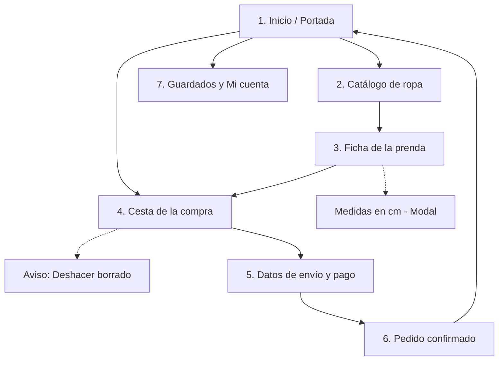
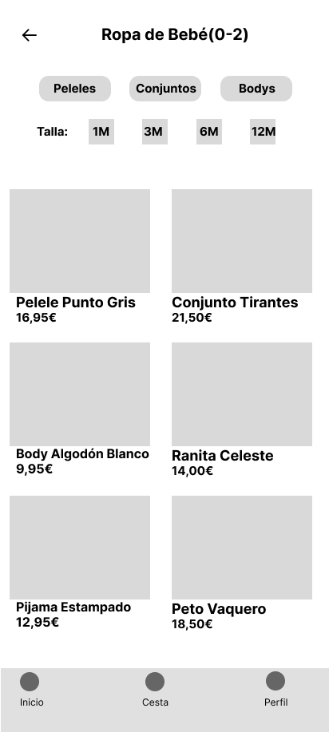
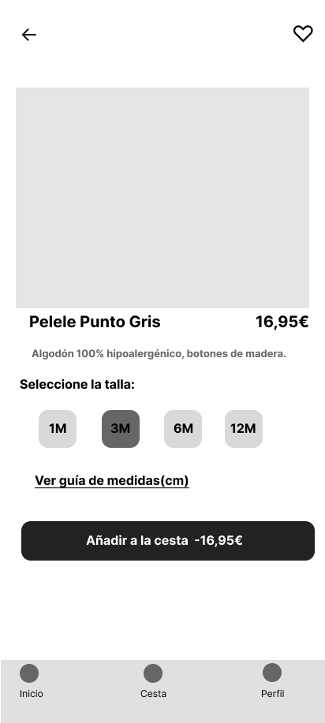
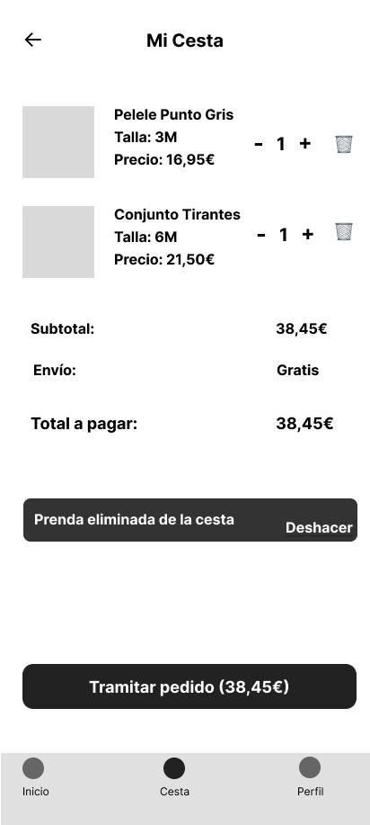
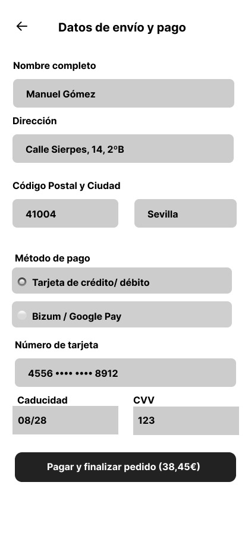
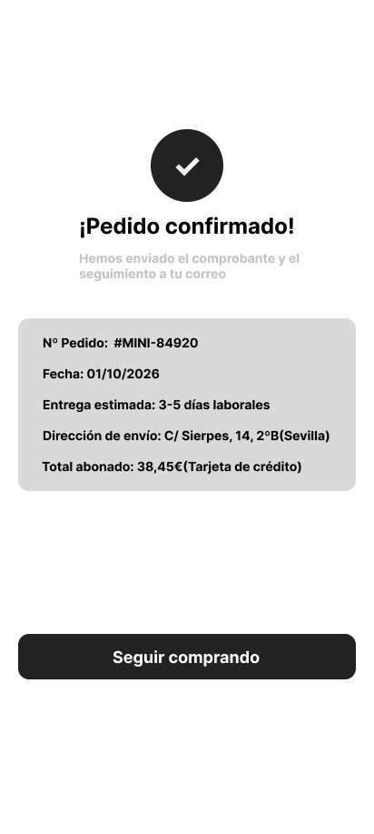
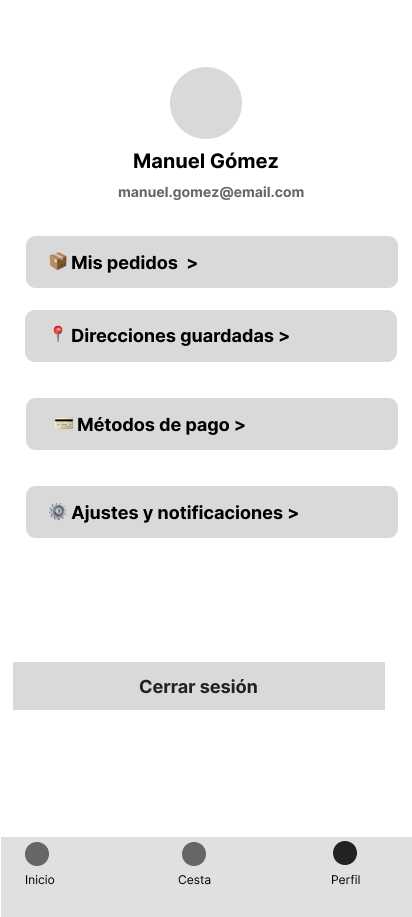

# Documentación de la interfaz — Minimoda

## 1. Justificación del diseño
### 1.1 Importancia del diseño centrado en el usuario
Vender ropa infantil por internet tiene un reto muy claro: quien compra (los padres o los abuelos) no es quien se la va a poner, y los niños cambian de talla casi de un mes para otro. Además, casi todos estos pedidos se hacen con prisas desde el móvil, en el transporte público o con el crío en brazos. Si la app no es directa, no te ayuda a acertar con la talla a la primera o te mete formularios interminables, la gente se agobia, cierra la aplicación y se va a la tienda física de toda la vida. Centrar el diseño en el usuario aquí no es un extra estético, es lo que evita carritos abandonados y disgustos con devoluciones.

### 1.2 Objetivos y metas del proyecto
1. **Completar un pedido en menos de 2 minutos:** Mediremos el tiempo que tarda un usuario desde que entra en la pantalla de inicio hasta que llega a la confirmación de compra sin atascarse.
2. **Cero dudas con el tallaje:** Que el 100% de los usuarios que entren a la ficha de un producto puedan consultar las medidas en centímetros sin perder de vista la prenda ni salirse a otra página.
3. **Evitar rechazos en el formulario de pago:** Reducir a menos del 5% los fallos al rellenar el checkout marcando en rojo los errores de forma clara antes de enviar los datos.

### 1.3 Beneficios esperados
- **Para el usuario:** Se quita el agobio de no saber qué talla elegir, puede comprar con una sola mano sin hacer malabares y no pierde tiempo rellenando mil campos.
- **Para el negocio:** Menos paquetes devueltos por tallas equivocadas y un aumento claro en las compras recurrentes de padres que buscan reponer básicos rápido.

## 2. Investigación y análisis de usuarios

### 2.1 Datos demográficos y segmentación
Para no diseñar a ciegas ni inventarnos problemas desde la mesa del ordenador, hicimos una pequeña fase de investigación de guerrilla:
- **Entrevistas rápidas:** Hablamos con 4 madres y padres jóvenes para ver cómo compran ropa infantil habitualmente por el móvil.
- **Observación directa:** Le pedimos a dos personas mayores que intentasen buscar un chándal de 4 años en un par de apps conocidas para ver dónde se quedaban atascados.
- **Revisión de quejas reales:** Leímos decenas de reseñas de una estrella en Google Play de tiendas de ropa para detectar los cabreos más repetidos de los usuarios.

De esa observación salieron dos perfiles muy claros con necesidades totalmente opuestas:
1. **Comprador por urgencia / reposición (28 a 40 años):** Padres y madres que compran porque el niño ha roto las rodillas del pantalón, se le ha quedado pequeño el calzado o necesitan mudas para la guardería. Buscan rapidez, filtros fiables y pagar con un toque.
2. **Comprador por compromiso / regalo (55 a 72 años):** Abuelos, padrinos y tíos. No tienen prisa pero sí mucha inseguridad técnica. Casi nunca saben la talla exacta y les da miedo equivocarse con el pago o que les cuelen suscripciones raras.

### 2.2 Personas

#### Persona 1: Laura Gómez, 33 años (Madre con prisas)
- **Perfil:** Administrativa, madre de Mateo (2 años recién cumplidos).
- **Escenario de uso:** Compra desde el sofá a última hora de la tarde, o de pie en el autobús de vuelta a casa, casi siempre sujetando al niño con el otro brazo o pendiente de que no tire nada.
- **Objetivos:** Reponer básicos en menos de tres minutos y sin tener que pensar demasiado.
- **Puntos de fricción / Frustraciones:** Odia las apps que te obligan a registrarte con contraseña antes de ver el catálogo. Se desespera cuando una prenda dice "Talla 2" sin especificar si equivale a 86 cm o 92 cm, porque cada marca talla como le da la gana.

#### Persona 2: Manuel Martínez, 67 años (El abuelo detallista)
- **Perfil:** Jubilado, abuelo de Lucía (5 años).
- **Escenario de uso:** Sentado en el salón con las gafas de cerca puestas, queriendo comprarle un vestido bonito a su nieta para su cumpleaños.
- **Objetivos:** Encontrar rápido la sección de niñas, ver fotos grandes donde se distinga bien la tela y pagar sin liarla.
- **Puntos de fricción / Frustraciones:** Si la letra es pequeña, no la lee. Si le sale un mensaje en inglés, se cree que es un virus y cierra la aplicación. Le aterra meter los dígitos de su tarjeta si la pantalla no transmite confianza y claridad.

### 2.3 Análisis de la competencia

Para ver cómo lo hacen los que ya están en el mercado, me instalé y estuve mirando tres aplicaciones conocidas:

- **Zara:**
  Visualmente es una pasada, parece una revista de moda y las fotos entran por los ojos. El problema gordo viene al intentar usarla rápido: la letra es minúscula, los iconos apenas contrastan y encontrar el filtro para poner "niño de 3 años" es un laberinto entre colecciones y editoriales.
  * *Lo que aplicamos a Minimoda:* Nos quedamos con la idea de mostrar fotos limpias sin saturar la pantalla, pero metiendo textos que se lean sin forzar la vista y botones grandes que se puedan pulsar con una sola mano.

- **H&M:**
  Lo mejor que tiene es cómo resuelven la guía de tallas: no solo te dicen "talla 4", sino que te ponen los centímetros de estatura del crío al lado, lo cual quita muchas dudas a los padres. Lo malo es que la aplicación es muy cansina; nada más entrar te saltan avisos de promociones, tarjetas del club y descuentos que distraen un montón de lo que quieres buscar.
  * *Lo que aplicamos a Minimoda:* Copiar la idea de poner las medidas en centímetros dentro de la ficha de cada prenda, pero abriéndolas en una ventanita rápida desde abajo para que el usuario no se pierda entre anuncios ni se salga del producto.

- **Mayoral:**
  Es una referencia clara en ropa infantil y acierta mucho en cómo divide la tienda de inicio (separando recién nacido, bebé y niños más mayores). Sin embargo, la experiencia al comprar es un dolor de cabeza ya que para pagar te piden rellenar un formulario eterno, confirmar pantallas que se podrían resumir en un clic y al final te cansas de meter datos.
  * *Lo que aplicamos a Minimoda:* Aprovechamos esa separación clara por grupos de edad en la parte superior, pero simplificando el carrito y el proceso de compra a dos pasos rápidos para que nadie abandone a mitad de camino.

### 2.4 Insights y hallazgos clave

Después de hablar con los padres, ver a mi familia pelearse con el móvil y probar las otras apps, me quedaron claras cuatro cosas que la app tiene que cumplir sí o sí:

1. **La gente usa el móvil a una mano mientras hace otra cosa:** Casi nadie se sienta tranquilo con las dos manos a comprar ropa de niños. Van con el crío en brazos, cargando bolsas o de pie en el bus.
   * *Decisión de diseño:* Todo lo importante tiene que estar abajo, al alcance cómodo del pulgar. No meter botones clave arriba del todo donde no llegas sin usar las dos manos.
2. **Dudar con la talla hace que la gente no compre:** En cuanto un padre o un abuelo no tiene claro si la talla le va a quedar chica al crío el mes que viene, cierra la app y no gasta.
   * *Decisión de diseño:* Dentro de cada prenda ponemos un botón grande de guía de tallas que abre una ventana rápida desde abajo con la estatura en centímetros y la edad aproximada, para que lo miren al momento sin salirse de la foto de la ropa.
3. **Con las prisas se tocan cosas sin querer:** Es supertípico darle a la pantalla sin querer con la palma de la mano o con un dedo torpe y borrar algo que tenías en la cesta.
   * *Decisión de diseño:* Si borras una prenda del carrito, la app no te castiga: te muestra un aviso abajo durante unos segundos con un botón de "Deshacer" para recuperarla al toque sin tener que volver a buscarla.
4. **Los formularios largos agobian a la gente mayor:** A una persona mayor le pones tres pantallas pidiéndole datos raros o códigos que no entiende y piensa que le van a estafar.
   * *Decisión de diseño:* El proceso de pago tiene que ser directo al grano. Si se equivoca en un número, el campo se marca claramente y le dice en su idioma qué ha fallado, sin tecnicismos.

## 3. Diseño de la interfaz

### 3.1 Mapa de navegación
Al pensar cómo estructurar la app, lo primero que tuve claro es que no queríamos menús raros ni botones escondidos. Si una madre va con prisa o un abuelo no domina mucho el móvil, meter las cosas dentro de un menú lateral de tres rayas es una trampa.

Por eso dejamos una barra fija abajo del todo con lo básico: Inicio, la Cesta y el Perfil. Así el usuario siempre tiene a golpe de pulgar el camino para volver a donde estaba. El proceso de compra lo planteamos recto y sin rodeos: entras, buscas por edad, abres la prenda, confirmas la talla en centímetros para no equivocarte, la echas a la cesta, metes los datos justos de envío/pago y listo. En ningún momento dejamos al usuario en un callejón sin salida; siempre hay una flecha clara para tirar hacia atrás o cancelar sin perder lo que ya tenías seleccionado.

### 3.2 Wireframes
Antes de meterme a Figma a meter colores, fotos o tipografías definitivas, me puse a plantear la estructura básica de las pantallas en blanco y negro (wireframes). Lo hice con tres cosas muy claras en la cabeza para que la app no fuera un suplicio de usar:

- **Pensar en cómo se coge el móvil de verdad:** Cuando un padre o una madre está con el crío, casi nunca tiene las dos manos libres. Suele estar sujetando al niño, una bolsa o de pie en el bus con una sola mano. Por eso, todo lo que consideré obligatorio de pulsar lo coloqué abajo del todo, donde el pulgar llega sin estirar la mano ni hacer equilibrios con el teléfono.
- **Botones que se puedan pulsar a la primera:** Me da mucha rabia intentar darle a una talla o a un botón y pulsar el de al lado sin querer. Diseñé todos los elementos interactivos con un tamaño generoso y bien separados para que ni las personas mayores con menos pulso ni nadie con prisas se equivoque de botón.
- **No apretujar las cosas en pantalla:** En muchas tiendas online te meten diez productos por fila, y mil textos diminutos. Yo preferí dejar aire, que los márgenes se noten limpios y que cada prenda tenga su espacio para verse bien sin saturar.

A continuación se presentan las 7 pantallas obligatorias del flujo en baja fidelidad:

#### Componentes de Material 3 aplicados y decisiones estructurales
Para que la interfaz resultara familiar y no pareciese un invento raro, aproveché los componentes estándar de Material 3 que cualquiera que use Android ya reconoce sin pensar:

1. **La barra de abajo (Navigation Bar):** La dejé siempre visible en la base con tres accesos directos: Inicio, Cesta y Perfil. A cada icono le puse su palabra debajo escrita en grande para que personas mayores no tenga que descifrar qué significa cada dibujo.
2. **Los filtros rápidos tipo pastilla (Filter Chips):** En el catálogo, en vez de obligar al usuario a entrar a un menú desplegable eterno para filtrar, metí cuadritos horizontales arriba . Le das un toque con el dedo y se filtra la lista al momento.
3. **La hoja de tallas desde abajo (Bottom Sheet):** Para la guía de tallas no quería que el usuario saliera de la prenda a otra web. Al darle a "Ver medidas" decidí levantar una pequeña ventana desde el borde inferior de la pantalla con los centímetros de altura y pecho. Lo miras en dos segundos y la bajas deslizando con el dedo.
4. **Campos de formulario que avisan al instante (Text Fields):** En el momento de pagar, si te dejas el código postal vacío o pones mal un número de tarjeta, la casilla se pone en rojo al instante y te explica abajo con palabras sencillas qué falta, sin tecnicismos raros ni dejándote la duda de por qué no avanza.
5. **El aviso de deshacer borrado (Snackbar):** Si vas con prisas y le das por error a la papelera en la cesta, programé que salte un cartelito negro abajo durante unos segundos con la opción de "Deshacer". Así recuperas la ropa sin tener que volver a buscarla desde cero.
### 3.3 Guía de estilo Material Design 3

#### Color semilla y paleta tonal
Para Minimoda se seleccionó como color semilla el tono verde azulado `#006874`. Transmite frescura, tranquilidad y pulcritud, funcionando muy bien para un catálogo infantil mixto sin recurrir a estereotipos.

Mediante el plugin *Material Theme Builder* se generó el sistema tonal dinámico para modo claro y oscuro, garantizando el cumplimiento de contraste WCAG 2.1 nivel AA:

- **Modo Claro (Light Scheme):**
  - `Primary`: `#006874` / `OnPrimary`: `#FFFFFF` (ratio: 4.68:1 — cumple AA)
  - `PrimaryContainer`: `#9EEFFD` / `OnPrimaryContainer`: `#001F24` (ratio: 13.5:1)
  - `Surface`: `#F8FAFA` / `OnSurface`: `#191C1D` (ratio: 15.8:1)
  - `Error`: `#BA1A1A` / `OnError`: `#FFFFFF` (ratio: 5.7:1)

- **Modo Oscuro (Dark Scheme):**
  - `Primary`: `#82D3E0` / `OnPrimary`: `#00363D`
  - `Surface`: `#101415` / `OnSurface`: `#E1E3E3`

#### Tipografía y escala de tipos
Se utiliza la tipografía oficial **Roboto**, respetando los roles estándar:
- **Headline Small (24sp / 32sp):** Títulos de pantallas principales (Catálogo, Checkout).
- **Title Large (22sp / 28sp):** Nombre del producto en la ficha detallada.
- **Title Medium (16sp / 24sp - Medium):** Precios destacados y cabeceras de sección.
- **Body Large (16sp / 24sp):** Descripciones y campos de entrada de formulario.
- **Label Large (14sp / 20sp - Medium):** Textos en botones y chips de filtrado.

#### Rejilla y espaciado
- **Retícula:** 4 columnas con márgenes laterales de 16 dp y medianil de 8 dp.
- **Sistema de espaciado:** Múltiplos de 8 dp (8, 16, 24, 32 dp).
- **Accesibilidad táctil:** Área táctil mínima de 48×48 dp en todos los componentes interactivos.

### 3.4 Prototipo de alta fidelidad
A partir de la estructura validada en los wireframes y aplicando los tokens de diseño generados para Material Design 3, se implementó el prototipo interactivo final a escala de dispositivo móvil compacto en una página independiente de Figma (*Prototipo*).

#### Decisiones visuales y componentes aplicados
- **Jerarquía y coherencia visual:** Se utilizó la paleta tonal basada en el color semilla `#006874`. Las llamadas a la acción principales (*CTA*) destacan en color `Primary` asegurando una ratio de contraste superior a 4.5:1.
- **Microinteracciones y modales:** La guía de tallas se implementó como un *Bottom Sheet* desplegable desde el borde inferior para no perder el contexto de la prenda. La barra de navegación inferior (*Navigation Bar*) mantiene el indicador visual de sección activa en todo momento.
- **Tratamiento de errores y confianza en el pago:** En la pantalla de checkout se diseñaron estados de error semántico explícitos en color `#BA1A1A` con mensajes directos en lenguaje natural, facilitando la corrección inmediata de datos erróneos.
- **Flujo interactivo continuo:** El prototipo enlaza sin interrupciones desde la exploración en portada hasta la pantalla final de confirmación, permitiendo simular una experiencia de compra real a una mano.

## 4. Validación y pruebas

### 4.1 Metodología
Para verificar la usabilidad y comprobar si se cumplían los objetivos iniciales, se organizaron pruebas cualitativas con 2 participantes representativos de los perfiles definidos:
- **Participante 1 (Perfil Joven / Reposición):** Realizó la prueba usando el móvil en movimiento con una sola mano.
- **Participante 2 (Perfil Sénior / Regalo):** Realizó la prueba prestando especial atención a la legibilidad y claridad del proceso de pago.

**Tareas evaluadas:**
1. Encontrar una prenda infantil y localizar sus medidas exactas en centímetros.
2. Añadir la prenda a la cesta y avanzar hacia la tramitación del pedido.
3. Completar el formulario de pago identificando y corrigiendo un error simulado.

### 4.2 Resultados
- **Tiempo de completado:** Ambos usuarios finalizaron el flujo principal de compra en menos de 2 minutos (media de 1 minuto y 35 segundos), cumpliendo el objetivo 1.
- **Comprensión del tallaje:** La consulta de medidas en centímetros mediante la ventana modal inferior (*Bottom Sheet*) resolvió las dudas de talla sin necesidad de abandonar la ficha del producto, cumpliendo el objetivo 2.
- **Recuperación ante fallos:** El aviso visual inmediato en los campos de formulario del checkout permitió subsanar los datos sin bloqueos en el flujo, cumpliendo el objetivo 3.

### 4.3 Iteraciones y mejoras
A partir de las observaciones de las pruebas se aplicaron dos ajustes:
1. **Aumento del contraste en selectores de talla:** Se incrementó el grosor del borde en los chips de talla para que el usuario sénior identificara la selección con menor esfuerzo visual.
2. **Claridad en el botón de retroceso:** Se reforzó el área táctil del icono de flecha atrás en la cabecera (*Top App Bar*) para garantizar una pulsación cómoda a una mano.

## 5. Entrega y documentación final

### 5.1 Justificación del diseño propuesto
La interfaz de Minimoda da respuesta directa a las necesidades detectadas durante la investigación inicial:
- **Accesibilidad y diseño ergonómico:** La concentración de acciones clave en la zona inferior de la pantalla favorece el uso con una sola mano, adaptándose a situaciones cotidianas de compra rápida.
- **Prevención de devoluciones:** El acceso directo a las medidas corporales en centímetros dentro de la propia ficha reduce la incertidumbre de talla habitual en la ropa infantil.
- **Simplicidad en la conversión:** La estructura lineal de la cesta y el checkout, combinada con componentes estándar de Material 3, reduce la carga cognitiva y transmite seguridad a perfiles no técnicos.

### 5.2 Recomendaciones y pasos a seguir
1. **Fase de desarrollo nativo:** Implementar la interfaz en Jetpack Compose utilizando Material Design 3 y consumiendo los tokens definidos en `diseno/estilos.json`.
2. **Ampliación de accesibilidad:** Integrar compatibilidad completa con lectores de pantalla (*TalkBack*) añadiendo descripciones de contenido específicas en imágenes y estados de stock.
3. **Optimización del pago:** Incorporar pasarelas de pago rápido en un solo toque (Google Pay) para reducir aún más la fricción en el checkout.

## 6. Referencias bibliográficas
- Material Design 3: *Components, Foundation and Color System*. Material.io / Google.
- W3C: *Web Content Accessibility Guidelines (WCAG) 2.1*. World Wide Web Consortium.
- Norman, D.: *The Design of Everyday Things*. Basic Books.

Palabra del día:reloj