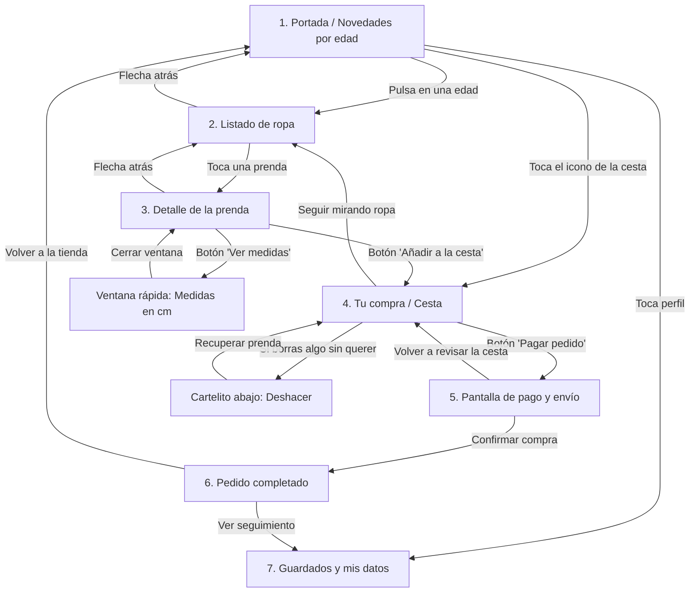

# Documentación de la interfaz — Minimoda

## 1. Justificación del diseño
### 1.1 Importancia del diseño centrado en el usuario
Vender ropa infantil por internet tiene un reto muy claro: quien compra (los padres o los abuelos) no es quien se la va a poner, y los niños cambian de talla casi de un mes para otro. Además, casi todos estos pedidos se hacen con prisas desde el móvil, en el transporte público o con el crío en brazos. Si la app no es directa, no te ayuda a acertar con la talla a la primera o te mete formularios interminables, la gente se agobia, cierra la aplicación y se va a la tienda física de toda la vida. Centrar el diseño en el usuario aquí no es un extra estético, es lo que evita carritos abandonados y disgustos con devoluciones.

### 1.2 Objetivos y metas del proyecto
1. **Completar un pedido en menos de 2 minutos:** Mediremos el tiempo que tarda un usuario desde que entra en la pantalla de inicio hasta que llega a la confirmación de compra sin atascarse.
2. **Cero dudas con el tallaje:** Que el 100% de los usuarios que entren a la ficha de un producto puedan consultar las medidas en centímetros sin perder de vista la prenda ni salirse a otra página.
3. **Evitar rechazos en el formulario de pago:** Reducir a menos del 5% los fallos al rellenar el checkout marcando en rojo los errores de forma clara antes de enviar los datos.

### 1.3 Beneficios esperados
* **Para el usuario:** Se quita el agobio de no saber qué talla elegir, puede comprar con una sola mano sin hacer malabares y no pierde tiempo rellenando mil campos.
* **Para el negocio:** Menos paquetes devueltos por tallas equivocadas  y un aumento claro en las compras recurrentes de padres que buscan reponer básicos rápido.

## 2. Investigación y análisis de usuarios

### 2.1 Metodología de campo y recogida de datos
Para no diseñar a ciegas ni inventarnos problemas desde la mesa del ordenador, hicimos una pequeña fase de investigación de guerrilla:
* **Entrevistas rápidas:** Hablamos con 4 madres y padres jóvenes para ver cómo compran ropa infantil habitualmente por el móvil.
* **Observación directa:** Le pedimos a dos personas mayores que intentasen buscar un chándal de 4 años en un par de apps conocidas para ver dónde se quedaban atascados.
* **Revisión de quejas reales:** Leímos decenas de reseñas de una estrella en Google Play de tiendas de ropa para detectar los cabreos más repetidos de los usuarios.

### 2.2 Segmentación de perfiles detectados
De esa observación salieron dos perfiles muy claros con necesidades totalmente opuestas:
1. **Comprador por urgencia / reposición (28 a 40 años):** Padres y madres que compran porque el niño ha roto las rodillas del pantalón, se le ha quedado pequeño el calzado o necesitan mudas para la guardería. Buscan rapidez, filtros fiables y pagar con un toque.
2. **Comprador por compromiso / regalo (55 a 72 años):** Abuelos, padrinos y tíos. No tienen prisa pero sí mucha inseguridad técnica. Casi nunca saben la talla exacta y les da miedo equivocarse con el pago o que les cuelen suscripciones raras.

### 2.3 Personas ficticias

#### Persona 1: Laura Gómez, 33 años (Madre con prisas)
* **Perfil:** Administrativa, madre de Mateo (2 años recién cumplidos).
* **Escenario de uso:** Compra desde el sofá a última hora de la tarde, o de pie en el autobús de vuelta a casa, casi siempre sujetando al niño con el otro brazo o pendiente de que no tire nada.
* **Objetivos:** Reponer básicos en menos de tres minutos y sin tener que pensar demasiado.
* **Puntos de fricción / Frustraciones:** Odia las apps que te obligan a registrarte con contraseña antes de ver el catálogo. Se desespera cuando una prenda dice "Talla 2" sin especificar si equivale a 86 cm o 92 cm, porque cada marca talla como le da la gana.

#### Persona 2: Manuel Martínez, 67 años (El abuelo detallista)
* **Perfil:** Jubilado, abuelo de Lucía (5 años).
* **Escenario de uso:** Sentado en el salón con las gafas de cerca puestas, queriendo comprarle un vestido bonito a su nieta para su cumpleaños.
* **Objetivos:** Encontrar rápido la sección de niñas, ver fotos grandes donde se distinga bien la tela y pagar sin liarla.
* **Puntos de fricción / Frustraciones:** Si la letra es pequeña, no la lee. Si le sale un mensaje en inglés, se cree que es un virus y cierra la aplicación. Le aterra meter los dígitos de su tarjeta si la pantalla no transmite confianza y claridad.

### 2.4 Análisis de la competencia (pruebas directas en el móvil)

Para ver cómo lo hacen los que ya están en el mercado, me instalé y estuve mirando tres aplicaciones conocidas:

* **Zara:**
  Visualmente es una pasada, parece una revista de moda y las fotos entran por los ojos. El problema gordo viene al intentar usarla rápido: la letra es minúscula, los iconos apenas contrastan y encontrar el filtro para poner "niño de 3 años" es un laberinto entre colecciones y editoriales. 
  * *Lo que aplicamos a Minimoda:* Nos quedamos con la idea de mostrar fotos limpias sin saturar la pantalla, pero metiendo textos que se lean sin forzar la vista y botones grandes que se puedan pulsar con una sola mano.

* **H&M:**
  Lo mejor que tiene es cómo resuelven la guía de tallas: no solo te dicen "talla 4", sino que te ponen los centímetros de estatura del crío al lado, lo cual quita muchas dudas a los padres. Lo malo es que la aplicación es muy cansina; nada más entrar te saltan avisos de promociones, tarjetas del club y descuentos que distraen un montón de lo que quieres buscar.
  * *Lo que aplicamos a Minimoda:* Copiar la idea de poner las medidas en centímetros dentro de la ficha de cada prenda, pero abriéndolas en una ventanita rápida desde abajo para que el usuario no se pierda entre anuncios ni se salga del producto.

* **Mayoral:**
  Es una referencia clara en ropa infantil y acierta mucho en cómo divide la tienda de inicio (separando recién nacido, bebé y niños más mayores). Sin embargo, la experiencia al comprar es un dolor de cabeza ya que  para pagar te piden rellenar un formulario eterno, confirmar pantallas que se podrían resumir en un clic y al final te cansas de meter datos.
  * *Lo que aplicamos a Minimoda:* Aprovechamos esa separación clara por grupos de edad en la parte superior, pero simplificando el carrito y el proceso de compra a dos pasos rápidos para que nadie abandone a mitad de camino.
### 2.5 Conclusiones clave y cómo las aplicamos en la app

Después de hablar con los padres, ver a mi familia pelearse con el móvil y probar las otras apps, me quedaron claras cuatro cosas que la app tiene que cumplir sí o sí:

1. **La gente usa el móvil a una mano mientras hace otra cosa:** Casi nadie se sienta tranquilo con las dos manos a comprar ropa de niños. Van con el crío en brazos, cargando bolsas o de pie en el bus. 
   * *Nuestra solución:* Todo lo importante tiene que estar abajo, al alcance cómodo del pulgar. No meter botones clave arriba del todo donde no llegas sin usar las dos manos.

2. **Dudar con la talla hace que la gente no compre:** En cuanto un padre o un abuelo no tiene claro si la talla le va a quedar chica al crío el mes que viene, cierra la app y no gasta.
   * *Nuestra solución:* Dentro de cada prenda ponemos un botón  grande de guía de tallas que abre una ventana rápida desde abajo con la estatura en centímetros y la edad aproximada, para que lo miren al momento sin salirse de la foto de la ropa.

3. **Con las prisas se tocan cosas sin querer:** Es supertípico darle a la pantalla sin querer con la palma de la mano o con un dedo torpe y borrar algo que tenías en la cesta.
   * *Nuestra solución:* Si borras una prenda del carrito, la app no te castiga: te muestra un aviso abajo durante unos segundos con un botón de "Deshacer" para recuperarla al toque sin tener que volver a buscarla.

4. **Los formularios largos agobian a la gente mayor:** A una persona mayor le pones tres pantallas pidiéndole datos raros o códigos que no entiende y piensa que le van a estafar.
   * *Nuestra solución:* El proceso de pago tiene que ser directo al grano . Si se equivoca en un número, el campo se marca claramente y le dice en su idiomaqué ha fallado, sin tecnicismos.

## 3. Cómo organizamos la tienda y cómo se pasa de una pantalla a otra

### 3.1 La idea detrás de la navegación
Al pensar cómo estructurar la app, lo primero que tuve claro es que no queríamos menús raros ni botones escondidos. Si una madre va con prisa o un abuelo no domina mucho el móvil, meter las cosas dentro de un menú lateral de tres rayas es una trampa. 

Por eso dejamos una barra fija abajo del todo con lo básico: Inicio, la Cesta y el Perfil. Así el usuario siempre tiene a golpe de pulgar el camino para volver a donde estaba. El proceso de compra lo planteamos recto y sin rodeos: entras, buscas por edad, abres la prenda, confirmas la talla en centímetros para no equivocarte, la echas a la cesta, metes los datos justos de envío/pago y listo. En ningún momento dejamos al usuario en un callejón sin salida; siempre hay una flecha clara para tirar hacia atrás o cancelar sin perder lo que ya tenías seleccionado.

### 3.2 El mapa de navegación (Diagrama Mermaid)

### 3.3 Qué va en cada una de las 7 pantallas obligatorias

1. **Portada (Inicio):** Nada más abrir la app ves los accesos rápidos según los años del crío (Bebé, 2 a 6 años, etc.) y un par de fotos grandes con lo más vendido para no saturar con mil banners.
2. **Listado de ropa (Catálogo):** Los productos colocados en dos columnas limpias. Fotos que se vean bien, el precio claro en negrita y filtros rápidos arriba para no tragarte prendas que no son de la talla que buscas.
3. **Detalle de la prenda (Ficha):** Fotos grandes que se pueden pasar deslizando el dedo, selector de tallas y lo más importante: el botón para abrir las medidas en centímetros sin cambiar de pantalla. Abajo del todo, fijo, el botón de añadir a la cesta.
4. **Cesta (Carrito):** Se ve claro lo que llevas metido, la talla elegida y el precio final con el envío ya sumado (sin sorpresas de última hora). Si le das a borrar a algo por error, sale un aviso rápido para recuperarlo con un toque.
5. **Pantalla de pago (Checkout):** Un formulario corto y espaciado para la dirección y la tarjeta o Bizum. Si metes un número mal, la casilla se pone en rojo y te avisa al momento, sin esperar a que le des a enviar.
6. **Pedido completado:** Pantalla limpia que te confirma que el cobro está bien hecho, te deja tu número de pedido y un botón grande para volver a la portada tranquilamente.
7. **Guardados y mis datos (Perfil):** Para tener a mano las cosas que te han gustado pero que no vas a comprar hoy, y ver por dónde va el paquete que acabas de pedir.

Palabra del día: 29