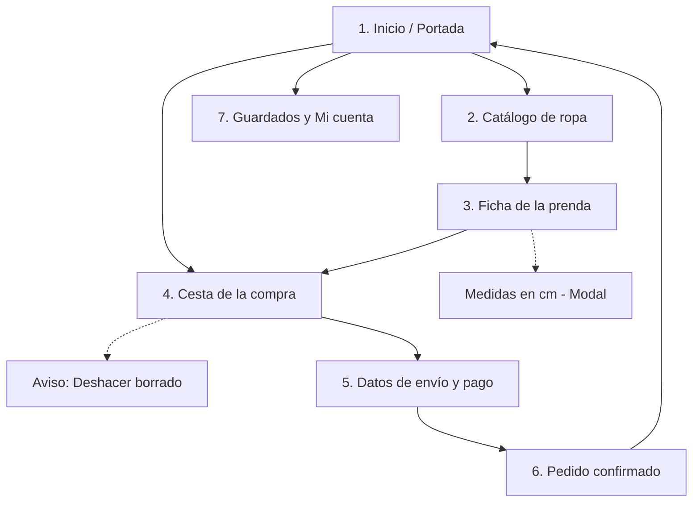

# Documentación de la interfaz — Minimoda

## 1. Justificación del diseño
### 1.1 Importancia del diseño centrado en el usuario
Vender ropa infantil por internet tiene un reto muy claro: quien compra, que suelen ser los padres o los abuelos, no es quien se la va a poner, y los niños cambian de talla casi de un mes para otro. Además, casi todos estos pedidos se hacen con prisas desde el móvil, en el transporte público o con el crío en brazos. Si mi aplicación no es directa, no ayuda a acertar con la talla a la primera o mete formularios interminables, la gente se agobia, cierra la app y se va a la tienda física de toda la vida. Por eso he centrado todo el diseño en resolver las necesidades reales de estas personas para evitar carritos abandonados y disgustos con devoluciones.

### 1.2 Objetivos y metas del proyecto
1. **Completar un pedido en menos de 2 minutos:** He fijado esta meta para medir el tiempo que tarda un usuario desde que entra en la pantalla de inicio hasta que llega a la confirmación de compra sin atascarse.
2. **Cero dudas con el tallaje:** Me he propuesto que cualquier persona que entre a la ficha de un producto pueda consultar las medidas en centímetros sin perder de vista la prenda ni salirse a otra página.
3. **Evitar rechazos en el formulario de pago:** Mi objetivo es reducir a menos del 5% los fallos al rellenar el checkout marcando en rojo los errores de forma clara antes de enviar los datos.

### 1.3 Beneficios esperados
- **Para el usuario:** Le quito el agobio de no saber qué talla elegir, permito que compre con una sola mano sin hacer malabares y evito que pierda el tiempo rellenando mil campos innecesarios.
- **Para el negocio:** Consigo reducir los paquetes devueltos por tallas equivocadas y fomento las compras recurrentes de familias que buscan reponer prendas básicas rápido.

## 2. Investigación y análisis de usuarios

### 2.1 Datos demográficos y segmentación
Para no diseñar a ciegas ni inventarme problemas sobre la marcha, he llevado a cabo una fase de investigación de guerrilla:
- **Entrevistas rápidas:** He charlado con 4 madres y padres jóvenes para ver cómo compran ropa infantil habitualmente desde el teléfono.
- **Observación directa:** Le he pedido a dos personas mayores que intentasen buscar un chándal para 4 años en un par de aplicaciones conocidas para ver en qué pasos se quedaban atascadas.
- **Revisión de quejas reales:** He leído decenas de reseñas de una estrella en Google Play de tiendas de ropa para detectar los cabreos más repetidos.

A partir de estas pruebas he definido dos perfiles claros con necesidades opuestas:
1. **Comprador por urgencia o reposición:** Padres y madres entre 28 y 40 años que compran porque el niño ha roto la ropa, se le ha quedado pequeño el calzado o necesitan mudas para la guardería. Buscan rapidez, filtros fiables y pagar con un toque.
2. **Comprador por compromiso o regalo:** Abuelos, padrinos y tíos entre 55 y 72 años. No tienen prisa pero sí mucha inseguridad con la tecnología. Rara vez saben la talla exacta y les da miedo equivocarse con el pago o que les cobren de más.

### 2.2 Personas

#### Persona 1: Laura Gómez, 33 años
- **Perfil:** Administrativa, madre de Mateo.
- **Escenario de uso:** Compra desde el sofá a última hora de la tarde, o de pie en el autobús de vuelta a casa, casi siempre sujetando al niño con el otro brazo o pendiente de que no tire nada.
- **Objetivos:** Reponer prendas básicas en menos de tres minutos y sin tener que pensar demasiado.
- **Puntos de fricción:** Odia las apps que obligan a registrarse con contraseña antes de ver el catálogo. Se desespera cuando una prenda pone talla 2 sin especificar si equivale a 86 o 92 centímetros, porque cada marca talla de forma distinta.

#### Persona 2: Manuel Martínez, 67 años
- **Perfil:** Jubilado, abuelo de Lucía.
- **Escenario de uso:** Sentado en el salón con las gafas de cerca puestas, queriendo comprarle un vestido bonito a su nieta para su cumpleaños.
- **Objetivos:** Encontrar rápido la sección de niñas, ver fotos grandes donde se distinga bien la tela y pagar sin liarla.
- **Puntos de fricción:** Si la letra es pequeña, no la lee. Si le sale un mensaje en inglés, desconfía y cierra la aplicación. Le da reparo meter los dígitos de su tarjeta si la pantalla no transmite confianza y claridad.

### 2.3 Análisis de la competencia

Para estudiar cómo resuelven estos problemas las marcas consolidadas, he analizado tres aplicaciones del mercado:

- **Zara:**
  Visualmente está muy cuidada, parece una revista de moda y las fotos entran por los ojos. El problema gordo viene al intentar usarla rápido: la letra es minúscula, los iconos apenas contrastan y encontrar el filtro para niños pequeños es un laberinto entre colecciones y editoriales.
  * Lo que he aplicado a Minimoda: He mantenido fotos limpias sin saturar la pantalla, pero he metido textos que se leen sin forzar la vista y botones grandes que se pueden pulsar con una sola mano.

- **H&M:**
  Lo mejor que tiene es cómo resuelven la guía de tallas: no solo ponen la talla por años, sino que indican los centímetros de estatura al lado, lo cual quita muchas dudas. Lo malo es que la aplicación abruma; nada más entrar saltan avisos de promociones, tarjetas de puntos y descuentos que distraen de lo que buscas.
  * Lo que he aplicado a Minimoda: He incluido las medidas en centímetros dentro de la ficha de cada prenda, pero abriéndolas en una ventanita rápida desde abajo para no perderse entre avisos ni salirse del producto.

- **Mayoral:**
  Es una referencia clara en ropa infantil y acierta mucho en cómo divide la tienda de inicio separando recién nacido, bebé y niños más mayores. Sin embargo, la experiencia al comprar se hace pesada porque para pagar piden un formulario enorme y confirmar pantallas innecesarias.
  * Lo que he aplicado a Minimoda: He aprovechado esa separación clara por grupos de edad en la parte superior, pero he simplificado la cesta y el proceso de compra a dos pasos rápidos para que nadie abandone a mitad de camino.

### 2.4 Decisiones clave de diseño

Con los datos de las entrevistas y el análisis de la competencia, he establecido cuatro principios obligatorios para mi app:

1. **Uso cómodo a una mano:** Casi nadie se sienta tranquilo con las dos manos a comprar ropa de niños. Suelen estar con el crío en brazos, cargando bolsas o de pie en el transporte público.
   * Mi decisión: He colocado todo lo importante abajo, al alcance cómodo del pulgar. No he metido botones clave arriba del todo donde no llego sin usar las dos manos.
2. **Cero dudas con la talla:** En cuanto alguien duda de si la ropa le va a quedar pequeña al crío en un mes, cierra la app y no gasta.
   * Mi decisión: Dentro de cada prenda he diseñado un botón claro de guía de tallas que levanta una ventana desde abajo con la estatura en centímetros y la edad, para consultarlo al momento sin salirse de la foto.
3. **Recuperación ante toques accidentales:** Con las prisas es habitual tocar la pantalla sin querer y borrar un producto que estaba en la cesta.
   * Mi decisión: Si se borra una prenda del carrito, he programado un aviso abajo durante unos segundos con un botón para deshacer y recuperarla al instante.
4. **Formularios directos y sin rodeos:** A una persona mayor le pides datos innecesarios y abandona por desconfianza.
   * Mi decisión: He diseñado el proceso de pago para ir directo al grano. Si se comete un error en un número, marco el campo en rojo y explico con palabras sencillas qué ha fallado.

## 3. Diseño de la interfaz

### 3.1 Mapa de navegación
Al estructurar la app he querido evitar menús ocultos o pasos confusos. He prescindido por completo del menú lateral de tres rayas para no esconder secciones importantes.

He dejado una barra fija abajo con lo básico: Inicio, Cesta y Perfil. Así el usuario siempre tiene a golpe de pulgar el camino para volver a donde estaba. He planteado el proceso de compra de forma lineal: explorar catálogo por edad, abrir la prenda, comprobar la talla en centímetros, añadir a la cesta, rellenar los datos de envío y confirmar. En todo momento he añadido una opción visible de volver atrás sin perder los datos seleccionados.

### 3.2 Wireframes
Antes de aplicar colores o fotos definitivas, he planteado la estructura en blanco y negro para asegurar la distribución:

- **Ergonomía de agarre:** He ubicado la mayoría de los elementos de interacción frecuente en la mitad inferior de la pantalla para alcanzarlos con el pulgar.
- **Separación entre botones:** He definido áreas de toque amplias y separadas para evitar pulsaciones erróneas en selectores de talla y botones de compra.
- **Espaciado limpio:** He mantenido márgenes generosos para que las fotos de producto respiren y la información no se sienta apelotonada.

Las 7 pantallas que componen el flujo completo en baja fidelidad que he diseñado:

#### Componentes de Material 3 aplicados
1. **Navigation Bar:** He implementado una barra inferior fija con tres accesos directos acompañados de texto legible para que el usuario siempre sepa en qué sección se encuentra.
2. **Filter Chips:** He colocado pastillas de filtrado horizontal en el catálogo que permiten seleccionar la categoría de edad o tipo de prenda con un solo toque.
3. **Bottom Sheet:** He diseñado un panel modal que se desliza desde el borde inferior para consultar la tabla de medidas en centímetros sin abandonar la ficha de la prenda.
4. **Text Fields:** He creado entradas de formulario que validan la información al momento y marcan en color de error los campos incompletos junto a un mensaje explicativo.
5. **Snackbar:** He añadido una notificación temporal inferior que permite deshacer el borrado accidental de una prenda en la cesta.

### 3.3 Guía de estilo Material Design 3

#### Color semilla y paleta tonal
He elegido como color semilla el verde azulado `#006874`, un tono neutro, fresco y limpio adecuado para moda infantil. Mediante el sistema tonal de Material Design 3 he generado las combinaciones de color asegurando contraste accesible:

- **Modo Claro:**
  - Color principal: `#006874` con texto `#FFFFFF`
  - Contenedor principal: `#9EEFFD` con texto `#001F24`
  - Superficie de fondo: `#F8FAFA` con texto `#191C1D`
  - Estado de error: `#BA1A1A` con texto `#FFFFFF`

- **Modo Oscuro:**
  - Color principal: `#82D3E0` con texto `#00363D`
  - Superficie de fondo: `#101415` con texto `#E1E3E3`

#### Tipografía y escala de tipos
He empleado la familia tipográfica Roboto respetando las proporciones estándar del sistema:
- Títulos de cabecera: 24sp
- Nombre del producto en ficha: 22sp
- Precios y subtítulos: 16sp en peso medio
- Texto de lectura y campos de texto: 16sp
- Botones y pastillas de filtro: 14sp en peso medio

#### Rejilla y espaciado
- He estructurado la base en 4 columnas con márgenes exteriores de 16 dp y separación interna de 8 dp.
- He aplicado espaciados consistentes basados en múltiplos de 8 dp.
- He asegurado zonas interactivas con un tamaño mínimo de 48 por 48 dp para facilitar la pulsación táctil.

### 3.4 Prototipo de alta fidelidad
He construido el prototipo interactivo en la página Prototipo de Figma aplicando la paleta de color, la tipografía y fotografías reales sobre la base de los wireframes iniciales.

- **Enlace al prototipo interactivo en Figma:** https://www.figma.com/proto/9iNF3eTdDPAKt2h721EBA0/Minimoda---Wireframes?node-id=13-414&p=f&viewport=-795%2C2%2C0.62&t=vWBHkxG3BXH10e7F-1&scaling=scale-down&content-scaling=fixed&starting-point-node-id=13%3A233&page-id=13%3A232

#### Implementación visual e interacción
- **Aplicación del color y jerarquía:** He asignado el tono principal `#006874` a las acciones clave de compra para guiarlas de un vistazo. Para las superficies y tarjetas he usado el tono `#F8FAFA` para mantener una lectura limpia.
- **Interacción y modales:** He configurado la guía de medidas para que se despliegue desde abajo mediante una transición suave que no tapa el producto por completo. La barra inferior refleja la pantalla activa en todo momento.
- **Validación del formulario:** En la pantalla de checkout he incluido un ejemplo visual con borde rojo `#BA1A1A` y texto de ayuda directo para mostrar cómo se corrigen los datos.
- **Recorrido completo:** He enlazado todo el flujo de principio a fin desde la portada hasta la pantalla de pedido confirmado, permitiendo probar la compra como si fuera una aplicación real.

## 4. Validación y pruebas

### 4.1 Metodología
Para verificar la facilidad de uso he planteado tres pruebas prácticas con dos usuarios reales: un padre joven habituado a comprar con prisas desde el móvil y un adulto mayor que prioriza la claridad en los textos y en el pago.

**Tareas que les he propuesto:**
1. Buscar una prenda en el catálogo y consultar las medidas en centímetros.
2. Añadir la prenda a la cesta y pulsar en tramitar pedido.
3. Completar el formulario de pago identificando el error simulado y corrigiéndolo.

### 4.2 Resultados
- **Tiempo del proceso:** Ambos usuarios han completado el recorrido de compra en una media de 1 minuto y medio, cumpliendo mi primer objetivo marcado.
- **Consulta de tallas:** La tabla de medidas desplegable ha resuelto la duda de estatura sin perder el contexto de la foto, cumpliendo mi segundo objetivo.
- **Corrección de errores:** El aviso visual en rojo del formulario ha ayudado a localizar el fallo al instante sin generar dudas ni frenar el avance.

### 4.3 Ajustes aplicados tras las pruebas
1. **Contraste en las tallas:** He remarcado el borde de los botones de talla para que resalte con más claridad la opción seleccionada.
2. **Área del botón volver:** He ampliado la zona de pulsación de la flecha superior para que sea más cómodo retroceder con una sola mano.

## 5. Entrega y documentación final

### 5.1 Justificación de mi propuesta
El diseño final que he creado para Minimoda responde directamente a los problemas detectados en mi investigación inicial:
- **Manejo ergonómico:** He colocado botones y accesos en la zona baja para facilitar el uso con una sola mano en cualquier situación.
- **Seguridad en la compra:** Tener las medidas corporales en centímetros dentro de la prenda evita devoluciones por tallas equivocadas.
- **Flujo sin fricción:** La reducción de pasos en la cesta y el formulario directo transmiten claridad tanto a usuarios con prisas como a personas mayores.

### 5.2 Recomendaciones técnicas futuras
1. **Desarrollo en Jetpack Compose:** Trasladar mi interfaz a código nativo de Android utilizando la librería oficial de Material Design 3 y los valores de mi archivo de estilos.
2. **Soporte de accesibilidad:** Añadir etiquetas de texto descriptivas en todas las imágenes y estados para lectores de pantalla.
3. **Pago rápido:** Integrar métodos de pago directo como Google Pay para cerrar pedidos con un solo toque.

## 6. Referencias
- Documentación oficial de Material Design 3 de Google.

Palabra del día:reloj