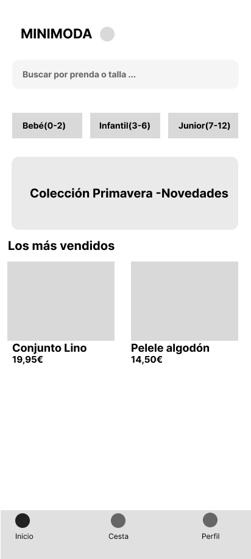

# 👕 Minimoda - App de Ropa Infantil

Bienvenido al repositorio oficial del diseño de la interfaz de Minimoda. 

## 📋 Índice
1. [Enlaces de Figma](#-enlaces-de-figma)
2. [Documentación completa del Proyecto](DOCUMENTACION.md)

## 🎨 Enlaces de Figma
- **Archivo de trabajo (con permisos de edición para la docente):** [Pega aquí tu enlace del archivo de Figma]
- **Prototipo navegable de alta fidelidad:** [Pega aquí el enlace del prototipo interactivo]

## 📱 Captura Destacada
